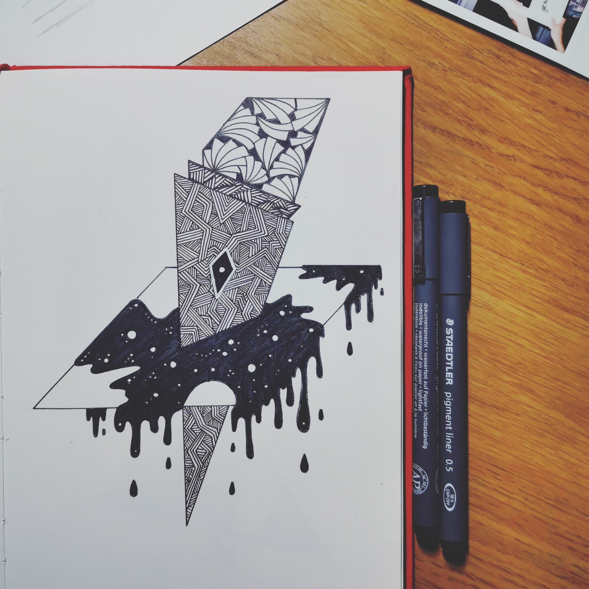
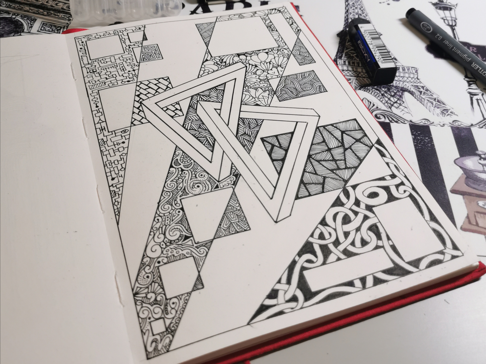

Having just started to experiment with 3D line drawings, I used it as an opportunity to try and learn some 3D modelling skills in Blender.

#### Working With Fluid Simulations

Original line drawing used as inspiration for the 3D piece

As part of creating the 3D piece, I wanted to make the liquid in the drawing animated. To do this, I used the fluid simulation tool in Blender. I positioned the input and domain objects, and adjusted the viscosity and other settings to mimic a thicker fluid.

The placement of the fluid input objects and viscosity settings required a reasonable amount of trial and error to create the optimal look. The speed of the input flow was also an important factor in creating the drip effect as it controlled the size and quantity of droplets.

<video autoplay controls loop style="width: 100%">
<source src="./deathwish.mp4" type="video/mp4" />
</video>

Rendered animation of 3D model exported from Blender

#### Basic Modelling

My first attempts were more static. Based on the drawing shown below, set out creating a 3D scene with various objects and experimented with animations in order to key camera movement.

<video autoplay controls loop style="width: 100%">
<source src="./triangles.mp4" type="video/mp4" />
</video>

Rendered animation of 3D model exported from Blender

