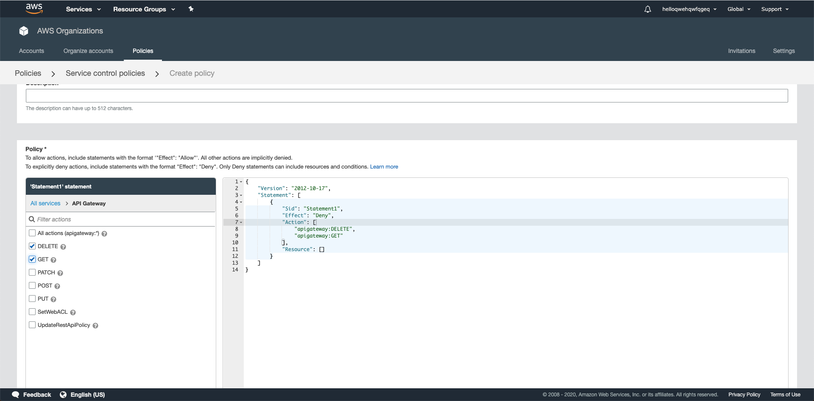
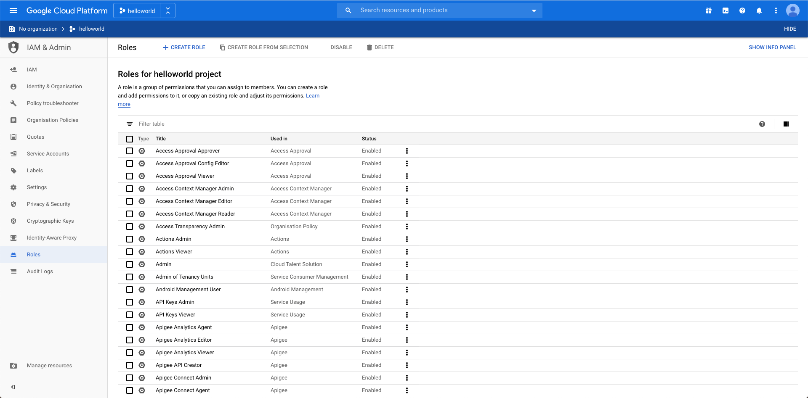
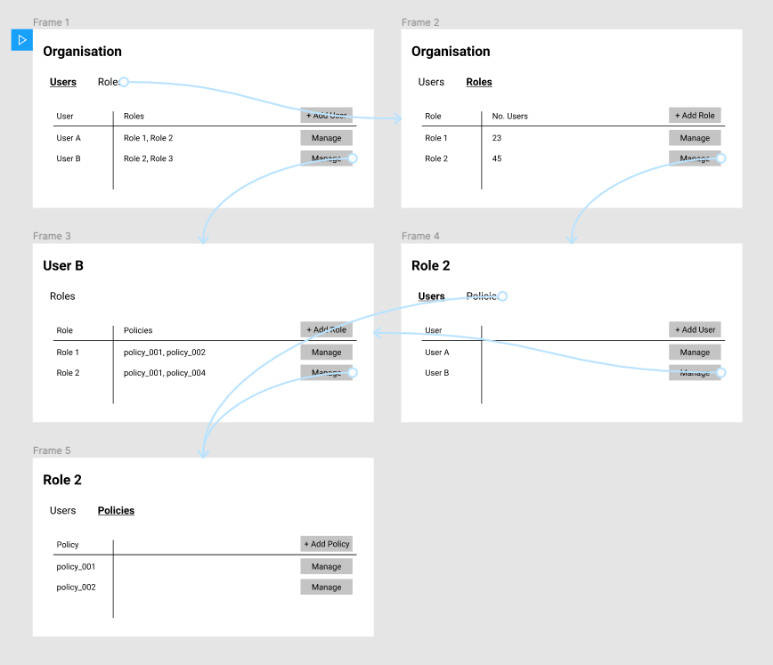
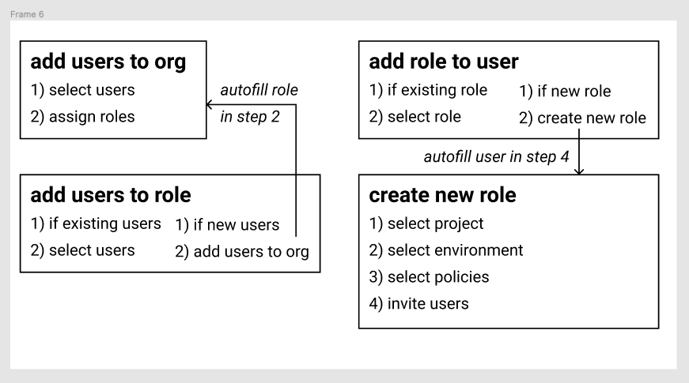
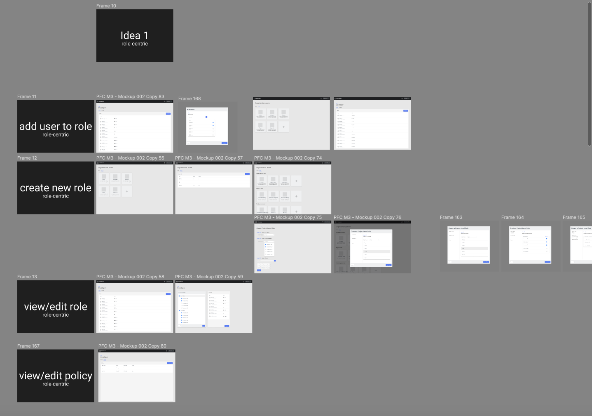

## THE PROJECT

In order to provide access to a range of new software products as part of a unified platform, <a href="https://improbable.io" target="_blank" rel="noopener noreferrer"> Improbable</a> had built an improved permissions management system. It would provide far more granular control over users and the actions they could perform. A command line tool for assigning and managing permissions had been built. The functionality needed to be integrated into the web interface to allow users to more easily interact with it.

<h4 align="center">CONTENTS</h4>

    <a href="#problem" style="white-space: nowrap">The Problem</a> 
    <a href="#role" style="white-space: nowrap">My Role</a> 
    <a href="#process" style="white-space: nowrap">My Process</a> 
    <a href="#outcomes" style="white-space: nowrap">The Outcomes</a> 

## THE PROBLEM

The permission management system was very complex and very customisable. We wanted to provide users with a controlled level of flexibility in the UI, without trying to port the full power of the command line tool into a web interface. The goal was to make permissions management accessible to those without a strong technical background and avoid the steep learning curve and complexity that often made systems administration a full time job.

## MY ROLE

As a <a href="../../"> User Experience Engineer</a> on Improbable's Web UIs team, I helped our lead designer understand how the permission management system worked in the back end, how users were expected to interact with the different concepts, map out various potential user flows. The primary outcome of my work was to be a design proposal for the User Management UI in the new platform.

## MY PROCESS

#### UNDERSTAND THE TECH

I started by reading the system design docs for the permission management system to understand the core concepts and functionality that had been built. I organised meetings with the engineers who built it to understand how they expected users to interact with the concepts. The system was very customisable, and there were a wide range of possible behaviours, not all of which were desirable.

On a high level: within an Organisation, a User's permissions would be described via their assigned Roles, which represented groups of policies. Policies defined resources and actions that could be taken on those resource i.e. read, write, execute. A user could be assigned multiple roles.

#### ANALYSE EXISTING SYSTEMS

I looked into how other platforms managed permissions, notably Github, Google Cloud Platform (GCP) and Amazon Web Services (AWS). They each had very different approaches with varying levels of flexibility. At some point, AWS simply provided users with a JSON editor and the technical documentation. In contrast, GCP had a more structured approach with a more clearly defined workflow. However, it still provided significant flexibility and as such had a complex UI, with a steep learning curve.

Amazon's "famed" JSON editor for permissions

GCP's similar Role-based system, with 500+ default roles

#### IDENTIFYING ASSUMPTIONS

The design of the user management system was shaped heavily by the expectations and assumptions we had for how users would define permissions. We expected people to define Roles relative to their job role. We assumed there would be Roles that could easily be shared between users. We assumed that some default set of Roles would be useful upon starting a project on the platform. These assumptions were built into how the engineering team had build the permissions system, and it was the job of the UI to enforce those expectations without being overbearing. The challenge of this design task was creating this balance.

At this stage, I worked closely with the engineering teams to interrogate these assumptions and test them with the users of the system. It was important we identify false assumptions, or unreasonable expectations and gain a broader understanding of what users would expect from a well-designed permissions system.

#### MAPPING USER FLOWS

Based on my understanding of how the permissions system worked, I listed:

- Actions the user would want to take
  - For each action, the steps or information the use would need to provide
- Potential pages/screens
  - For each screen, information the user would want to see

Using these, I mapped out possible paths between the screens and how they would interconnect depending on what the user wanted to achieve.

Connections between basic screens 

Key actions in a basic user flow

At this stage, I compiled my progress into a draft design doc to outline the current state of design insights and sent it to the engineering teams for feedback. It was important I check my understanding of the concepts regularly, in case the abstraction I was designing went off track.

#### ITERATING ON UI

Once I decided on the basic user flow and screens, I began iterating on different UI styles to display the information. I generated options that used tables, cards, lists, and modals, then shared them with the rest of my team for weekly feedback. I find it useful to categorise my wireframes by actions, to ensure that I cover all the necessary interactions. I also group my ideas by conceptual themes, for example I wanted to test out the idea of making the UI role-centric vs user-centric, i.e. focusing on different elements in the UI. Within these categories, I would iterate on UI styles and layouts.

Laying out my ideas in Figma

## THE OUTCOMES

This task was only one section of a larger design task to design Improbable's new admin platform. Other areas of exploration included Organisation Management, Navigation, Data Visualisation.

This exploration resulted in a interactive prototype of how the User Management pages of the admin platform would look and interact with each other. It also integrated with the Navigation work to lay out how the user would navigate to the user management functionality and its place within the platform's sitemap.

I also generated a design doc, outlining the stages of design, important design decisions that were made and their justifications. This was annotated with feedback from the engineering teams with clarifying comments about how the permissions system worked in the back end. This would be stored for future reference, as the project wouldn't reach development for a few more months, and the design would be questioned once more at that stage. It was important I tracked decisions that had been signed off and had answers to any design-related in order to streamline the process.
