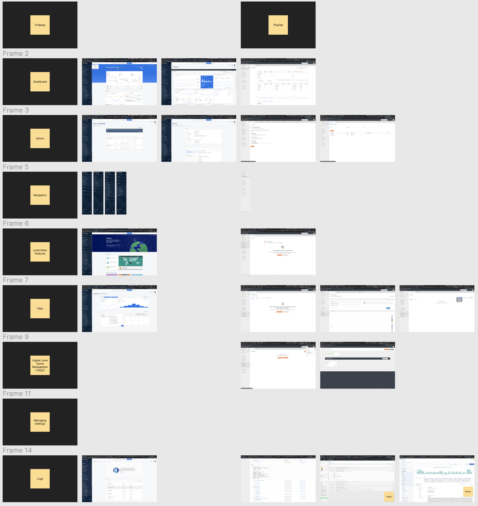
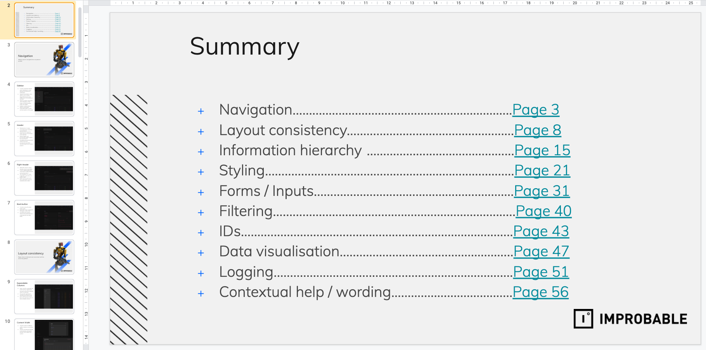
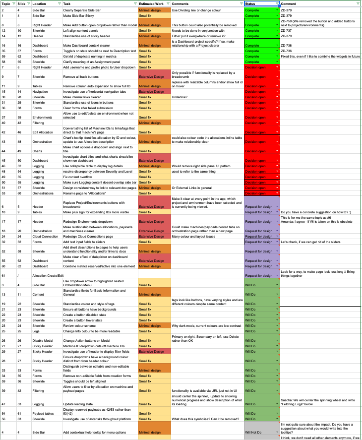

## THE PROJECT

One of <a href="https://improbable.io" target="_blank" rel="noopener noreferrer"> Improbable</a>'s new acquisitions (let's call it Company X) had their own single page application (SPA) used to manage and deploy clusters on various different cloud providers. It had been built by a small team, with limited design input and user research. They felt their platform lagged behind those of their competitors and were looking to make improvements.

<h4 align="center">CONTENTS</h4>

    <a href="#problem" style="white-space: nowrap">The Problem</a> 
    <a href="#role" style="white-space: nowrap">My Role</a> 
    <a href="#process" style="white-space: nowrap">My Process</a> 
    <a href="#outcomes" style="white-space: nowrap">The Outcomes</a> 

## THE PROBLEM

The platform had been built with essentially no user research or testing, by engineers that had a strong understanding of how the core software product worked. This had led to a platform geared towards power users with little emphasis on providing guidance or intuitive workflows.

However, the eventual product vision was to build a new SPA that integrated the Company X platform with Improbable's existing SPAs. However, the current Company X SPA was expected to remain their main offering for at least another 18 months. This meant that my recommendations would be evaluated on their value add with respect to necessary engineering time. Small changes, with medium to high impact would be prioritised over large structural changes which would be kept in mind for the design of the new integrated SPA.

## MY ROLE

As a <a href="../../improbable" target="_blank" rel="noopener noreferrer"> User Experience Engineer</a> on Improbable's Web UIs team, I was asked to evaluate the Company X platform for potential UX improvements in both the short and long term. While the primary outcome of this work was to be improvements that would be valuable despite an 18 month lifetime for the platform, a secondary outcome of this work was to be insights for the future design of an integrated platform.

## MY PROCESS

#### UNDERSTAND THE TECH

I started with a crash course (via Coursera and some very helpful teammates) on kubernetes and bare metal deployment to understand how cloud infrastructure worked. It helped me grasp the different concepts and how different elements that fit together. It was my understanding that Company X wanted to have a minimal learning curve for developers already familiar with cloud deploymen†, and so wanted to differ from established conventions as little as possible.

#### USE THE PLATFORM

Armed with an idea of how I thought Company X's underlying tech worked, I did a walk through of the Company X platform. I wanted to see if I could make sense of the site map and pick up how things worked just by clicking around. I took note of instances where Company X's concepts and informtion hierarchy differed from what I was expecting based on my tech research.

#### ANALYSE COMPETITORS

I was provided with a list of competitor platforms. I created test accounts on each and started to look for patterns and similarities between them. I created a list of shared functionality and compared how each platform UI for it. In particular, I was looking for instances where Company X's platform did not use an established pattern to do something.

Screenshot of my Competitor Analysis Figma file 

## THE OUTCOMES

My main output from this project was a slide deck outlining the UX/UI issues I found across the platform categorised into several themes: Navigation, Information Hierarchy, Forms/Inputs, Logs, Styling, Filtering, Layout Inconsistencies, and Contextual Information. The recommendations ranged from UI changes to improve accessibility and usability, areas where additional context or contextual help would be useful, gaps in functionality that users could reasonable expect and structural changes to the platform's sitemap and structure.

 Screenshot of slide deck summary page

As a result, for the meetings with the Company X product manager to discuss the recommendations, I categorised the recommendations by amount of design and engineering time needed: small change, needs minimal design to needs extensive design. This made it easier for the product manager to quickly decide whether he had the engineering capacity to commit to it, and which larger design task he would like our team to further help them on.

#### IMPACT

At the time of writing, 15% of the my recommendations are Complete, 10% were categorised Won't Do, 20% were broken down into specific design tasks for my team and 30% are categorised Will Do/ In Progress. 25% were flagged for further discussion and half of the Won't Do tasks were flagged for consideration during the integrated SPA design.

Screenshot of document categorising recommendations by estimated design work and tracking progress

