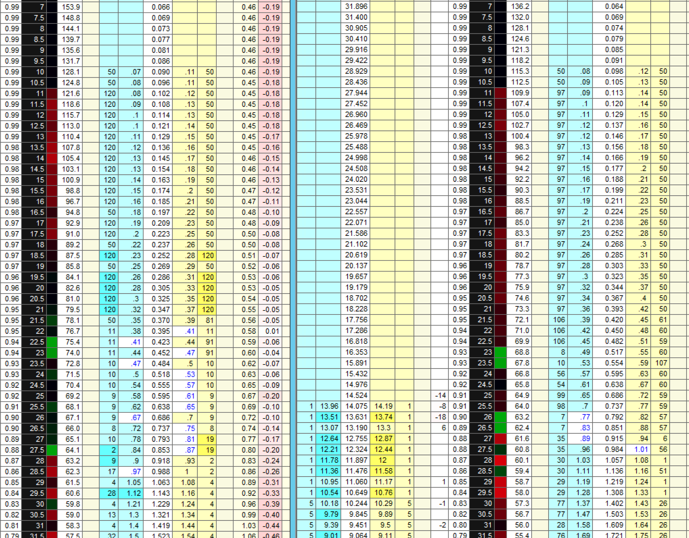
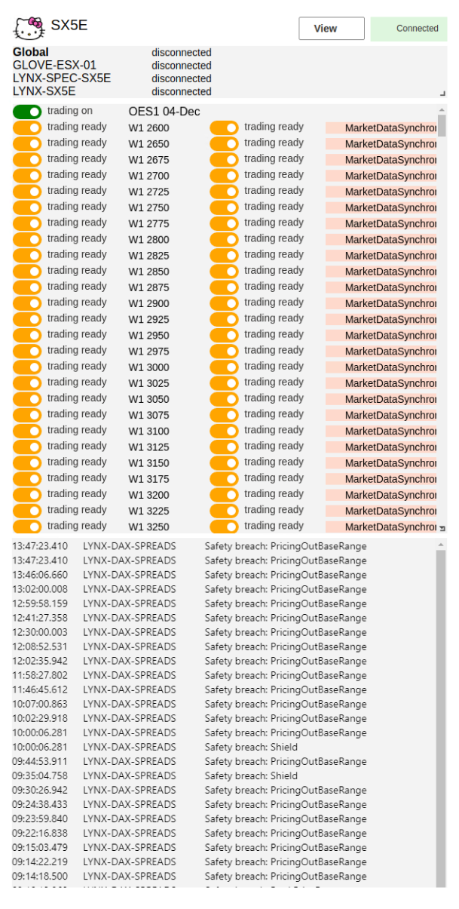
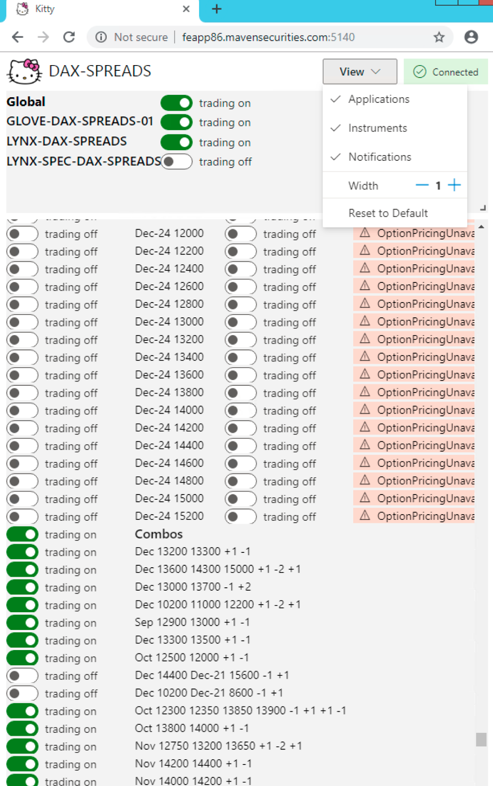
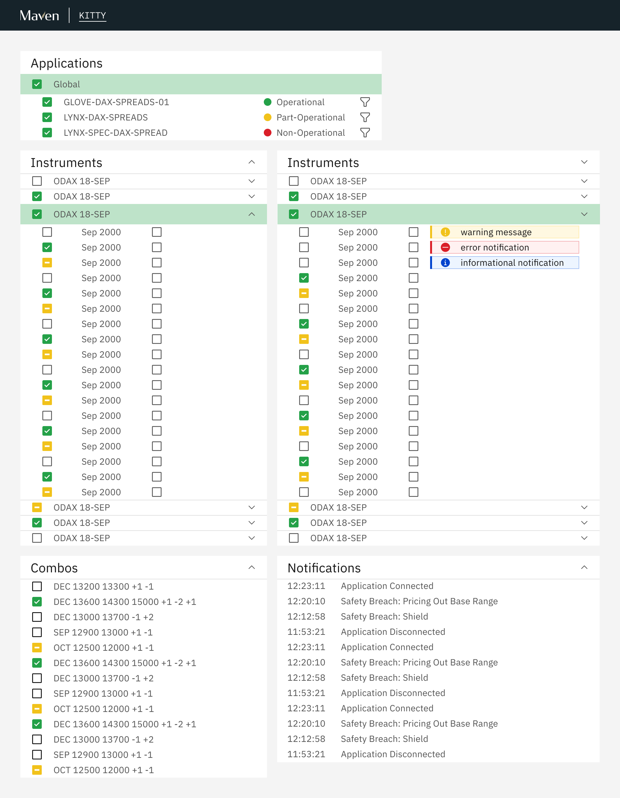
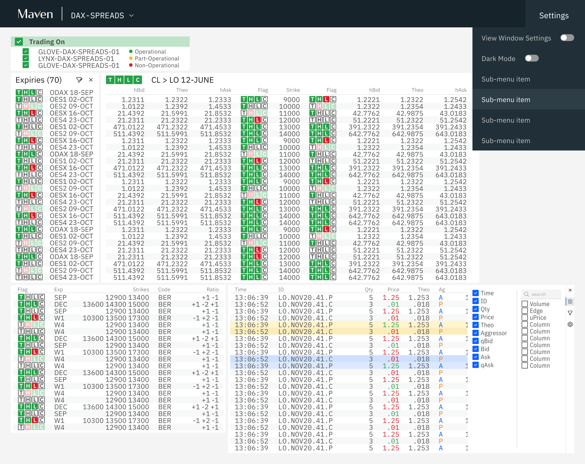
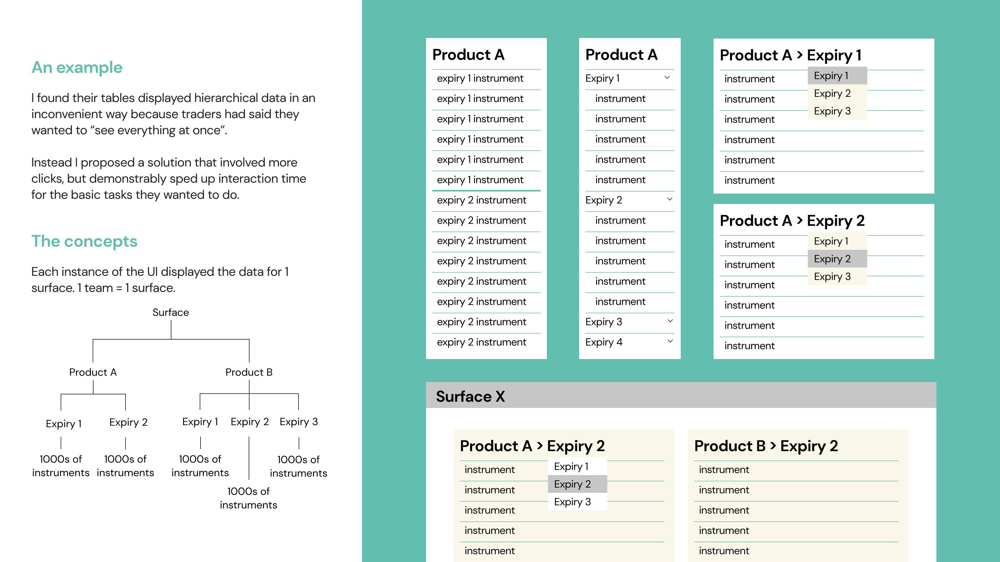

## MY ROLE

I joined <a href="https://www.mavensecurities.com/" target="_blank" rel="noopener noreferrer">Maven Securities</a>, a proprietary trading firm, as their first **User Experience Designer**. As part of my role, I design and develop a web-based trading application that aims to replace the third-party software that is currently used. My responsibilities include:

<ul>
    <li>Research, design and build new features </li>
    <li>Conduct usability tests and interviews on new designs</li>
    <li>Build and maintain internal library of reusable components and design frameworks for rapid prototyping (React, Typescript)</li> 
    <li>Collaborate with other teams to provide design skill to other engineering teams </li>
</ul>

<h4 align="center">CONTENTS</h4>

    <a href="#problem" style="white-space: nowrap">The Problem</a> 
    <a href="#product" style="white-space: nowrap">The Product</a> 
    <a href="#process" style="white-space: nowrap">My Process</a> 
    <a href="#progress" style="white-space: nowrap">Progress and Challenges</a> 
    <a href="#design" style="white-space: nowrap">Expanding Design at Maven</a> 

## THE PROBLEM

As part of Maven's expansion into the US trading markets, they would be unable to use their current third-party trading software to trade in the US. Instead of trying to find another third-party solution and adapt their internal systems to work with it, it was decided that Maven would build their own version. This would better cater to their traders' specific needs and integrate better with existing company systems.

## THE PRODUCT

The **Execution UI** is a data-heavy application used to:

<ul>
    <li>buy/sell stock options </li>
    <li>monitor the stock market</li>
    <li>monitor the state of company trading infrastructure i.e. what trading algorithms are running</li> 
</ul>

Screenshot of current third party solution 

## MY PROCESS

#### INITIAL PROTOTYPE

When I joined, a basic prototype had been built to showcase the possibilities of a web application. It provided 1 key function that would be featured in the Execution UI. I used this prototype as a sandbox for my initial design ideas, demonstrating the styling and interaction changes I wanted to introduce to the new Execution UI in a controlled way. I wanted to solicit initial feedback from stakeholders and develop building blocks with which to start designing the full Execution UI.

  

    
    <!-- 
The prototype I was given to upon joining. Built with Fluent UI components, it was already being used by some traders to toggle different states.
 -->
  

  

    
    <!-- 
A series of interviews with these traders revealed many possible improvements, short and long term. In particular, the hierarchical display of information was very important across all trading applications, but was represented very inconsistently across the existing internal applications 
 -->
  

    
<i>The prototype I was given to upon joining. Built with Fluent UI components, it was already being used by some traders to toggle different states. A series of interviews with these traders revealed many possible improvements, short and long term. In particular, the hierarchical display of information was very important across all trading applications, but was represented very inconsistently across the existing internal applications </i>

#### FIRST STEPS

<ol>
    <li>understand how the third-party solution works, what it does and how it is used within Maven</li>
    <li>**shadow and conduct user interviews** with traders to understand their workflows</li>
    <li>redesign prototype to validate impact of design improvements</li>
    <li>extend design to include more features required by Execution UI</li> 
</ol>

<!-- #### INITIAL REDESIGN -->

An initial redesign of the prototype interface

#### INITIAL FEEDBACK

I received some **unconventional** feedback to my redesign that challenged my ideas on how to design good interfaces.

- Interactions must be **fast** BUT minimise human **error**
  - _"I want to perform any action in under 2 click"_
  - _"I can't do anything by mistake, but checking is too slow"_
- **Whitespace** is the enemy
  - _"Everything is too far apart, I want to see as much information as possible onscreen"_
- Traders want to be **expert users**
  - _"I will memorise shortcuts and hotkeys to increase efficiency"_
  - _"I know that menu exists, there's no need for a button"_
- Usability ≠ easy to use
  - _"Good traders need good eysight, make the font smaller"_
  - _"Some things shouldn't be easy to do, we want to encourage thinking"_

#### RE-EVALUATING MY APPROACH

Immersing myself in the original requirements gathering, notes from observing trader workflows and feedback from the first redesign, I summarised the traders' priorities as:

1. **Condensed**
2. **Fast**
3. **Reliable**

I used these 3 principles as the focus of all future designs, ensuring they were always addressed.

Updated redesign of the prototype interface

In the updated redesign of the prototype interface. Key changes included:

- monospaced font for numbers
- condensed rows with odd row highlights
- reduce visual clutter i.e. line separators
- prioritise information over context

#### IMPLEMENTATION

Now that I knew what the prototype's design update would look like, I started to plan out the tech stack for the project. At this point, our first front-end engineer has just joined, and we worked on this together. We wrote up a plan for language and framework choices(**React, Typescript**), potential library options for important features i.e. React Beautiful DnD, React Grid Layout, AgGrid.

As we settled into our partnership, I took on responsibility for **building our component library** to match the design system that I had started to flesh out during the prototype redesigns. For this I chose Material UI as a base and used Styled Components to apply styling as required. As development of a production version of the product began, **I built the UI elements, i.e. creating layouts, menus and other interface-only interations.** Meanwhile, the engineer worked with other engineering teams to ensure that back end services were available to the front end, then where necessary, hooked up the non-functional UI components I built to the appropriate actions.

Looking at the longer term requirements for the product, once the basic template of a modular window UI had been decided, delivery milestones were defined corresponding to each window. While the windows had many shared features i.e. resizable, draggable, table-based. Each module/window had a certain number of unique features, requiring designated design and engineering time. As a team we focused on laying the groundwork, building shared functionality first before starting work on our first window. The idea was, as development continued, window development would speed up as we could build on work done for previous windows.

## PROGRESS AND CHALLENGES

At the time of writing, it has been just over a year since I first started at Maven and 9 momnths since we started development work. We have just given our first demo to stakeholders, showcasing 4 of the 7 windows required for a MVP release in 3 - 6 months time.

#### PERFORMANCE

As a data-heavy application, **performance is an important consideration**. I work closely with the front-end engineer to ensure that my designs did not place an unnecessary burden on performance. I investigate how best to marry our user's requirements with performance limitations. For example, user interviews suggested that traders wanted data to update 10 times per second. However, **user testing I conducted demonstrated that they realistically could not tell the difference between different update rates** past twice per second. This finding significantly eased the performance burden for our application.

#### CHANGE RESISTANCE

Traders have been using the current third-party solution for a long time. Many traders joined as graduates and have only ever traded using this platform. As the application that they spend most of their day using, it was important that I screen feedback I received for symptoms of a **reluctance to change old habits**. I noticed that designs that proposed larger changes in their workflow would face stronger criticism. However, they were not unresponsive to my suggestions as long as I could demonstrate they better addressed their priorities (Condensed, Fast, Reliable).

I am fortunate to have the support of leaders in my company, who are invested in improving the quality of their internal web applications. While they have historically been plagued with poor design, janky UI and a hacky code-base,, they have realised, that in an industry where speed is paramount, making UI flows more intuitive and less cluttered will make a difference.

## EXPANDING DESIGN AT MAVEN

#### CREATING CONSISTENCY

When I first joined Maven, I conducted a review of all the UIs built and maintained by the engineering teams. As the first and only designer at Maven, I was often consulted by these teams for design feedback. This made it clear to me that my role was the perfect opportunity to address the lack of consistency across Maven UIs. I introduced the concept of a **company-wide component library** so that internal applications could have a more consistent look and feel. It would also reduce the need for front-end skill across different engineering teams, which was lacking.

**As part of my Exeuction UI project, I am building a component library, which upon completion will be made available to all engineering teams for them to use on future web application development.**

#### CONSOLIDATING STANDARDS

In addition to consistency in the UI, I noticed that the display of data across trading teams and applications were inconsistent. The same field would have different abbreviations and be highlighted different colours. As this product, the Execution UI, will be used by all trading teams and consolidate functionality currently provided by multiple trading applications, it was a great opportunity to standardise conventions for displaying data.

I liased with each trading team to define a set of shared conventions that worked for everyone and am working on integrating them into the UI. These conventions are also being retroactively applied to existing applications where possible.
